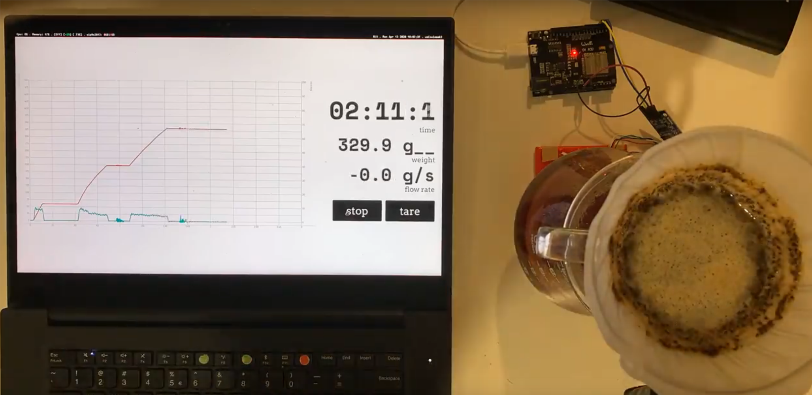
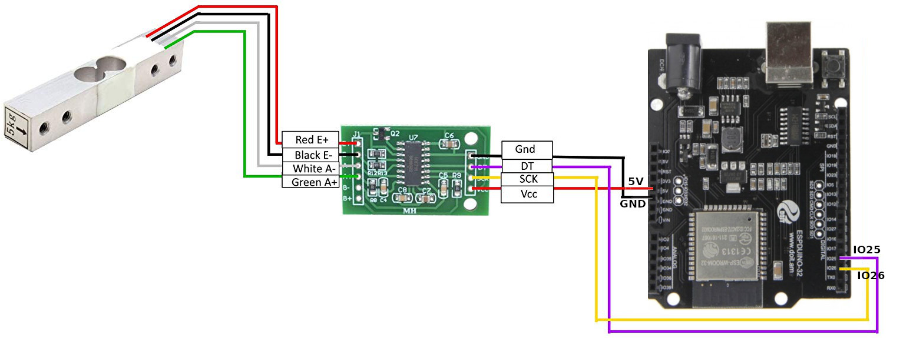

# Bluetooth Coffee Drip Scale

A bluetooth scale to keep track of your hand brew process. This may be useful if you're brewing your coffee with a V60, Chemex, etc...

**Disclaimer: As this is a tinkering project it is not meant for production use, and so far has only been tested a few times on my Linux machine. By following the instructions here, you agree that I am not responsible to any damage done in any form, including your coffee :D**

This repository contains both the code for hardware and the web interface for the scale.



[Video Version](https://gifs.com/gif/coffee-scale-E8m5DY)

## Components:

- [Wemos R32](https://www.amazon.de/s?k=wemos+R32&__mk_de_DE=%C3%85M%C3%85%C5%BD%C3%95%C3%91&ref=nb_sb_noss): Basically an ESP32 in an Arduino Uno board. The reason I go with this is because of the built in 5v output required for the HX711. But any other ESP board and external power supply with 5v should work too.

- [A load cell](https://www.amazon.de/Tragbarer-Elektronischer-W%C3%A4gezelle-HX711-Gewicht-Raspberry/dp/B076PYX5DW/ref=sr_1_1?__mk_de_DE=%C3%85M%C3%85%C5%BD%C3%95%C3%91&dchild=1&keywords=1kg+loadcell&qid=1586778094&sr=8-1): Usually these come with a load cell amplifier (the HX711), so you may not need to buy them separately.

- [HX711](https://circuits4you.com/wp-content/uploads/2016/11/Hx711-Module-Arduino.jpg): load cell amplifier. As the name suggests, it amplifies tiny currents coming from the the load cell make it possible for th eWemos R32 to read the signal.

- A laptop with bluetooth connection to run the web interface. The Wemos R32 is going to send its data to the web backend via Bluetooth Serial.

## Prerequisites

You'll need to have these software installed:

- Arduino IDE to flash the Wemos R32

- NodeJS to run the web application.

## Hardware setup

**Wiring**

This wiring requires no modification to the code, but if you're using a different wiring, make sure pin numbers are updated accordingly in the Arduino sketches.




**Install Arduino Libraries:**

- HX711: Download the Arduino HX711 library by downloading the zip file code from here. Open Arduino IDE, go to menu `Sketch > Include Library > Add .ZIP Library > choose the HX711 zip file`.

- Install the esp32 Arduino libraries: follow instruction from [the repository's Readme](https://github.com/espressif/arduino-esp32#installation-instructions)

**Make sure the Wemos R32 board is added to Arduino Board Manager**

To check, from the top menu, go to `File > Preferences`. In the `Settings` tab, there should be this link `https://dl.espressif.com/dl/package_esp32_index.json` in the `Additional Board Manager URLs`. If not, insert the link there, then go to `Tools > Board > Boards Manager`, search for `esp32` and install.

Now in `Tools > Boards` you should be able to see `ESP32 Dev Module` in the list. Select it.

**Calibrate the load cell & flash the scale sketch**

The calibration is needed only once to figure out the CALIBRATION_FACTOR that is specific to your load cell. To do this, follow instruction in the `./SparkFun_HX711_Calibration/SparkFun_HX711_Calibration.ino` file

After that, update the `CALIBRATION_FACTOR` number in `coffee_scale_btserial/coffee_scale_btserial.ino` file. Flash your Wemos with that value. You should now have a Bluetooth device named `Coffee Scale` that constantly writes to the Bluetooth Serial connection readings of the scale.

## Web interface

Make sure you have NodeJS install, and have the Wemos powered on beforehand.

The software will prompt for your sudo password, since it would need access to the computer's Bluetooth device. **Make sure you know what the code is doing before running this command. I won't be responsible for any damage or security breach if they happen because of this.**

Once the application started, the app will opens the link `http://localhost:8080` automatically in your web browser after successfully connected to the Wemos board.

```
# Enter the ./web directory
cd ./web

# Install the dependencies
npm i

# build the frontend and start the web application.
npm run build && npm start
```

## Development

To develop the frontend, use

```
npm run dev
```

## License

This project is licensed under the MIT License - see the [LICENSE](LICENSE) file for details
